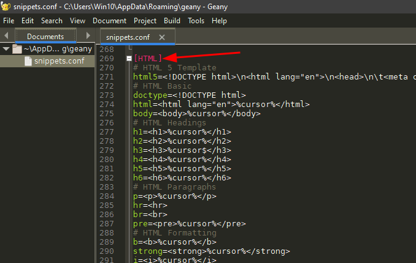

# Geany WebDev Snippets

## Introduction

I was a fan of [Notepad++](https://notepad-plus-plus.org/) source code editor, but it doesn't support Linux Operating System. Since I'm also a fan of Linux, so I decided to switch to another lightweight text editor. 

Fortunately, I found [Geany](https://www.geany.org/), a powerful, stable and lightweight programmer's text editor that provides tons of useful features without bogging down your workflow. It runs on Linux, Windows and macOS is translated into over 40 languages, and has built-in support for more than 50 programming languages.

However, Geany doesn't have [Emmet](https://emmet.io/) plugin for now. So for speeding up the workflow of my daily web development, I decided to make my version of web development snippets for Geany. And I made it, it's not perfect but "as long as it's simple, it makes your life simple". For those who want to use it as your web development snippets in Geany, I made an instruction below for you guys on how to add snippets into Geany.

## Getting Started

> ### Step 1: Copy the example snippets that you need from <a href="https://github.com/zhaolinlau/Geany-WebDev-Snippets/blob/main/snippets.conf" target="_blank">snippets.conf</a>

> ### Step 2: Open Geany and go to Tools -> Configuration Files -> snippets.conf
>
> 

> ### Step 3: Paste to the `[HTML]` and/or `[JavaScript]` and/or `[PHP]` based on what language you wanted to replace
>
> 

> ### Step 4: Press `CTRL+S` to save it

## Adding syntax highlighting & html snippets for .vue filetype

> ### Step 1: Open Geany and go to Tools -> Configuration Files -> filetype_extensions.conf
>
> 

> ### Step 2: Remove `#~ #` from `#~ # [Extensions]`
>
> *Now it should be look like* `[Extensions]`
>
> 

> ### Step 3: Remove `#~` from `#~ HTML=*.htm;*.html;*.shtml;*.hta;*.htd;*.htt;*.cfm;*.tpl;`
>
> *Now it should be look like* `HTML=*.htm;*.html;*.shtml;*.hta;*.htd;*.htt;*.cfm;*.tpl;`

> ### Step 4: Then add `*.vue;` to `HTML=*.htm;*.html;*.shtml;*.hta;*.htd;*.htt;*.cfm;*.tpl;`
>
> *Now it should be look like* `HTML=*.htm;*.html;*.shtml;*.hta;*.htd;*.htt;*.cfm;*.tpl;*.vue;`
> 
> 

> ### Step 5: Press `CTRL+S` to save it

## Summary

If you follow my instructions above, you will be able to use the snippets. Hope it helps you. Feel free to open issue if you have any issues. 
